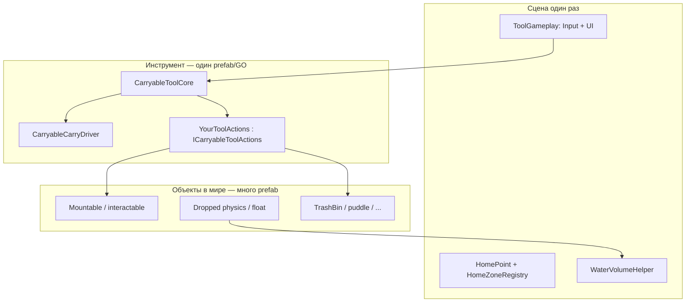

# Переносимые инструменты и объекты мира

Руководство по добавлению **новых инструментов** (кисть, ведро, факел и т.д.) и **объектов**, с которыми они взаимодействуют. Гарпун — только **эталонная реализация**, не шаблон имён.

Связанные файлы:

| Слой | Папка / тип | Назначение |
|------|-------------|------------|
| Общий каркас | [`Assets/REHozy/Scripts/CarryableTools/`](../Assets/REHozy/Scripts/CarryableTools/) | Подбор, переноска, Home, UI, ввод, `PlayerToolMode` |
| Логика инструмента | `*ToolActions.cs` на том же GO, что `CarryableToolCore` | Реализует [`ICarryableToolActions`](../Assets/REHozy/Scripts/CarryableTools/ICarryableToolActions.cs) |
| Объекты мира | Свой namespace, напр. `REHozy.Harpoon` | Груз, зоны (мусор), физика после сброса |
| Эталон | [`HarpoonToolActions`](../Assets/REHozy/Scripts/Harpoon/HarpoonToolActions.cs), [`HarpoonMountableItem`](../Assets/REHozy/Scripts/Harpoon/HarpoonMountableItem.cs) | Импал + сброс + вода + мусор |
| Декор из коробки | [`Decoration_Guide.md`](Decoration_Guide.md) | Отдельно от инструментов: коробка в Home, prefab + count, без hold-return |

---

## Три слоя (не смешивать)



1. **CarryableTools** — не знает про гарпун, кубы и квесты. Только FSM, мышь, Home, hold-return.
2. **`*ToolActions`** — единственное место, где описывается «что делает этот инструмент» (клик, hold, груз).
3. **Компоненты на prefab’ах мира** — как вести себя при монтировании, сбросе, уничтожении.

---

## Новый инструмент (например, кисть)

### 1. Enum режима

В [`PlayerToolMode`](../Assets/REHozy/Scripts/CarryableTools/PlayerToolMode.cs) уже есть заготовки (`Brush`, `Water`, …). Новый режим — новое значение enum.

Переключение активного режима (пока вручную / из квеста):

```csharp
PlayerToolModeState.Active = PlayerToolMode.Brush;
```

Пока `Active != toolModeId` на `CarryableToolCore`, инструмент **нельзя поднять** и ввод к нему не применяется.

### 2. GameObject инструмента

На корне инструмента (prefab):

| Компонент | Обязательно | Заметки |
|-----------|-------------|---------|
| `CarryableToolCore` | да | `toolModeId`, `tip`, `mountSocket` (если есть груз), `carryDriver`, `pickupCollider` |
| `CarryableCarryDriver` | да | Камера, `heightOffset`, ось «вперёд» наконечника (`tipForwardAxis`) |
| `YourToolActions` | да | `MonoBehaviour` + `ICarryableToolActions` на **том же** GO |
| Collider | да | Только для raycast подбора с земли; в переноске отключается core’ом |

**Не вешать** на инструмент: `HarpoonMountableItem`, `HarpoonDroppedCargo` — это про **груз**, не про инструмент.

### 3. Реализовать `ICarryableToolActions`

Контракт:

| Метод | Когда вызывается | Типичная логика |
|-------|------------------|-----------------|
| `HasCargo` | Каждый кадр в переноске (скорость наклона) | Есть ли прикреплённый объект / заряд |
| `CanReturnHome` | Hold-return UI в Home | Обычно «нет груза» + свои правила |
| `OnCarriedClick` | Короткий ЛКМ в переноске | Клик по миру: взять груз, смыть, полить… |
| `OnHoldCompleteInHome` | Долгий ЛКМ в Home, полоска заполнена | `tool.StartReturnHome()` или фаза «заблокирован» |
| `OnHoldCompleteOutsideHome` | Долгий ЛКМ вне Home | Другое действие или пусто |

Долгие анимации и блокировка ввода — через **`tool.StartPhase(IEnumerator, ...)`**, не через смену `CarryableToolState` вручную снаружи.

Пример паттерна (как у гарпуна):

- клик → `StartPhase(...)` → внутри фазы: mount / drop / consume;
- после фазы core снова в `Carried`, если фаза началась из переноски.

### 4. Сцена: общие объекты

Один раз на сцену (можно переиспользовать между инструментами):

| Объект | Компонент |
|--------|-----------|
| `HomePoint` | `BoxCollider` (trigger) + [`HomeZoneRegistry`](../Assets/REHozy/Scripts/CarryableTools/HomeZoneRegistry.cs) |
| `ToolGameplay` | [`CarryableToolInputHandler`](../Assets/REHozy/Scripts/CarryableTools/CarryableToolInputHandler.cs), [`CarryableReturnHoldUI`](../Assets/REHozy/Scripts/CarryableTools/CarryableReturnHoldUI.cs), [`CarryableAimReticleUI`](../Assets/REHozy/Scripts/CarryableTools/CarryableAimReticleUI.cs) |

В `CarryableToolInputHandler` указать **конкретный** `CarryableToolCore` активного инструмента. Если в сцене несколько инструментов одновременно — позже понадобится привязка input/UI к активному `PlayerToolMode` (сейчас один handler = один tool).

Вода: в сцене должен быть [`WaterVolumeHelper`](../../Assets/Bitgem/StylisedWater/URP/Scripts/Bitgem/VFX/StylisedWater/WaterVolumeHelper.cs) (как в SampleScene). Высота воды — **не по layer Water**, а через helper.

Отладочная расстановка: меню **REHozy → Setup Harpoon Test Objects** ([`HarpoonSceneSetup`](../Assets/REHozy/Editor/HarpoonSceneSetup.cs)) — создаёт Home + гарпун + тестовый куб; для нового инструмента копируй структуру, замени `HarpoonToolActions` на свой класс.

### 5. Hold-return (общее поведение)

- Короткий клик не показывает полоску (задержка ~0.1 с в UI).
- Hold **в Home**: полоска заполняется, если `CanReturnHome()`; иначе красное мигание (как груз на гарпуне).
- Hold **вне Home**: полоска не показывается; при заполнении — `OnHoldCompleteOutsideHome` (у гарпуна пусто).

---

## Новый объект мира (груз / цель инструмента)

Гарпуновские компоненты можно **переиспользовать**, если поведение то же (физика, вода, мусор). Для другой механики (лужа, растение) — **новый** скрипт по тому же **жизненному циклу**, не копия имён `Harpoon*`.

### Жизненный цикл «носимого груза»

```
[В мире, физика] 
    → OnMounted (кинематик, коллайдеры off, флоатеры off, удалить DroppedCargo)
    → AlignToSocket на mountSocket инструмента
    → [В переноске]
    → ReleaseDropped ИЛИ ConsumeInTrashBin
    → [Снова в мире]
```

Обязательные правила (проверено на гарпуне):

1. **Масштаб** — при `OnMounted` сохранить `lossyScale`; при parent на сокет и при отцеплении восстанавливать мировой scale (`ApplyWorldScale` + `Physics.SyncTransforms()`). Иначе куб «сплющивается».
2. **Повторный сброс в воду** — при подборе **удалять** `HarpoonDroppedCargo`; при новом `ReleaseDropped` вызывать `Initialize` (сброс фазы Dynamic, флоатеры off до входа в воду).
3. **Уничтожение / квест** — только явный путь «consume» (мусор, лужа), не обычный сброс на землю/в воду.
4. **Rigidbody** на prefab груза — для сброса; при монтировании kinematic.

### Prefab груза (шаблон как тестовый куб)

| Компонент | Когда нужен |
|-----------|-------------|
| `Collider` (не trigger) | Взаимодействие с землёй и raycast инструмента |
| `Rigidbody` | Сброс с физикой |
| `HarpoonMountableItem` (или аналог) | Если инструмент «цепляет» объект |
| `WateverVolumeFloater` (дочерний или на том же GO) | Плавание после сброса в воду; **выключен** на prefab, включает `HarpoonDroppedCargo` |
| `QuestSO` + поля на mountable | Только если уничтожение в зоне даёт прогресс квеста |

`HarpoonDroppedCargo` и `HarpoonCargoTrashDrop` **добавляются в рантайме** из `HarpoonMountableItem` — на prefab их не ставить.

### Зоны мира (мусор, лужа, …)

Отдельный компонент на trigger-коллайдере, например [`HarpoonTrashBin`](../Assets/REHozy/Scripts/Harpoon/HarpoonTrashBin.cs):

- `Contains(worldPoint)` для клика «сверху»;
- при необходимости `OnTriggerEnter` для автопоглощения.

В `*ToolActions` решать: клик над зоной → consume, иначе → drop.

### Layer masks

В `*ToolActions` задать:

- **mountableMask** — слои объектов, которые можно подцепить;
- при сбросе передать в `ReleaseDropped(groundMask, waterMask)` — земля для `Raycast`/`Grounded`, вода опционально для коллайдеров (основная вода — через `WaterVolumeHelper`).

---

## Чеклист: новый инструмент с нуля

- [ ] Добавить значение в `PlayerToolMode` (если ещё нет).
- [ ] Prefab: `CarryableToolCore` + `CarryableCarryDriver` + `XxxToolActions : ICarryableToolActions`.
- [ ] Настроить Tip, MountSocket (если есть груз), pickup collider, carry driver (камера, ось).
- [ ] Реализовать все 5 методов `ICarryableToolActions`; фазы через `StartPhase`.
- [ ] Сцена: `HomeZoneRegistry`, `ToolGameplay` с input/UI, ссылка на core.
- [ ] При смене квеста/фазы: `PlayerToolModeState.Active = ...`.
- [ ] Прогресс квеста: `QuestBus.GetInstance().OnUpdateCounter?.Invoke(questId, delta)` из **consume/finish** логики, не из core.

## Чеклист: новый переносимый объект (груз)

- [ ] Prefab: mesh + collider + rigidbody (+ floater disabled).
- [ ] Скрипт mount/unmount с тем же контрактом, что `OnMounted` / `AlignToSocket` / `ReleaseDropped` / `ConsumeIn...`.
- [ ] При mount: уничтожить runtime-компоненты прошлого сброса (`DroppedCargo`).
- [ ] При drop: `Initialize` сбрасывает фазу плавания.
- [ ] Consume: shrink/destroy + квест; не смешивать с обычным drop.
- [ ] Протестировать: подбор → сброс в воду → подбор → сброс в воду снова; подбор → мусор; масштаб после каждого цикла.

---

## Чего не делать

| Антипаттерн | Почему |
|-------------|--------|
| Логика квеста в `CarryableToolCore` | Core общий для всех инструментов |
| Дублировать input/UI на каждый инструмент | Один `ToolGameplay`, смена ссылки или фильтр по mode |
| `HarpoonDroppedCargo` на prefab | Только runtime; иначе залипает `Floating` |
| Shrink при обычном сбросе | Только consume-зона |
| Ждать layer `Water` | В проекте вода часто layer 0; используй `WaterVolumeHelper` |
| Несколько `CarryableToolCore` без дизайна mode | Input сейчас на один `tool` |

---

## Лопата и грязь (vertex deform, итерация 1)

Эталон: [`ShovelToolActions`](../Assets/REHozy/Scripts/Dirt/ShovelToolActions.cs), [`DirtDeformPatch`](../Assets/REHozy/Scripts/Dirt/DirtDeformPatch.cs), шейдер [`SnowVertexLit`](../Assets/REHozy/Shaders/SnowVertexLit.shader).

### Быстрый тест в сцене с гарпуном

1. Меню **REHozy → Setup Shovel Test Objects** — добавляет `Shovel`, `DirtPatch_Test`.
2. Меню **REHozy → Wire Tool Input To Shovel** — на `ToolGameplay` добавляет `CarryableToolModeBootstrap` (**Active Mode On Play = Shovel**), input/UI переключаются на лопату.
3. **Play** → ЛКМ по лопате → зажатый ЛКМ по патчу грязи.

**Почему лопата не поднимается:** нужны **оба** условия — режим `Shovel` и input, смотрящий на core лопаты. После Play статический `PlayerToolModeState` сбрасывается; без `CarryableToolModeBootstrap` снова будет `Harpoon`. `CarryableToolInputHandler` с **Bind Tool By Active Mode** сам находит core по режиму.

Вернуть гарпун: **REHozy → Wire Tool Input To Harpoon** (если добавите симметричное меню) или на `ToolGameplay` → `Carryable Tool Mode Bootstrap` → **Active Mode On Play = Harpoon**, и перепривязать input на гарпун.

### Ручной патч грязи

На mesh (ProBuilder / Plane): `MeshCollider`, материал `LeftToMelt/SnowVertexLit` (отдельный instance), компонент `DirtDeformPatch`. Опционально layer **DirtPatch** и mask на `ShovelToolActions`.

### Непрерывное действие при удержании ЛКМ

Реализует [`ICarryableToolCarriedUpdate`](../Assets/REHozy/Scripts/CarryableTools/ICarryableToolCarriedUpdate.cs); вызывается из `CarryableToolInputHandler` каждый кадр в переноске. В Home при hold-return копание блокируется (`returnHoldInProgress`).

### Квест «убрать грязь»

1. `QuestSO` с **Goal = 100** (100% убранной грязи).
2. На сцене: [`DirtQuestTracker`](../Assets/REHozy/Scripts/Dirt/DirtQuestTracker.cs) + ссылка на этот квест.
3. На патчах грязи (опционально): [`DirtPatchQuestLink`](../Assets/REHozy/Scripts/Dirt/DirtPatchQuestLink.cs) с тем же `QuestSO`.
4. Старт квеста через `QuestBus.OnStart` / `TestQuestActivator`.

Прогресс растёт по мере уменьшения deform map; при остатке грязи &lt; **5%** (настраивается) квест добивается до Goal, грязь полностью очищается и скрывается.

---

## Куда выносить общий код (по мере роста проекта)

Сейчас груз завязан на namespace `REHozy.Harpoon`. Когда появится второй инструмент с похожим грузом:

1. Вынести интерфейс вроде `ICarryableMountable` (`OnMounted`, `ReleaseDropped`, `ConsumeInZone`).
2. Обобщить `DroppedCargoPhysics` (земля + вода) в `REHozy.CarryableTools` или `REHozy.WorldItems`.
3. Оставить в `Harpoon` только impale-radius и `HarpoonTrashBin`.

До этого **допустимо** переиспользовать `HarpoonMountableItem` на любых кубах/пропах, которые подбирает гарпун.

---

## Ссылки

- План проекта: [`REHozy_14DayPlan.md`](REHozy_14DayPlan.md)
- Контракт действий: [`ICarryableToolActions.cs`](../Assets/REHozy/Scripts/CarryableTools/ICarryableToolActions.cs)
- Состояния FSM: [`CarryableToolState.cs`](../Assets/REHozy/Scripts/CarryableTools/CarryableToolState.cs)
