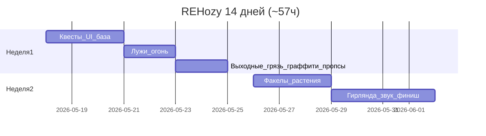
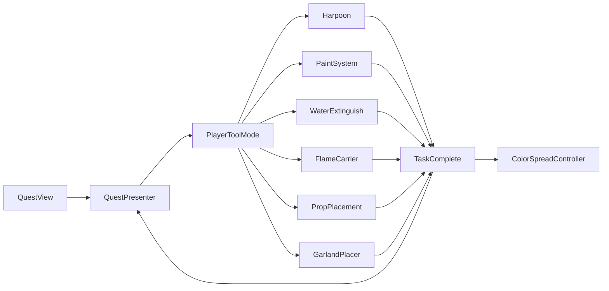

# План разработки REHozy на 14 дней

## Вердикт: успеешь ли?

**Короткий ответ:** играбельный цикл «задание → действие → следующее задание → финиш» — **да, если держать MVP-упрощения**. Визуально «как в голове» по всем пунктам — **скорее нет** без переноса части фич на 3-ю неделю.

| Режим | Часы | Результат |
|-------|------|-----------|
| Твой бюджет | **~57 ч** | Все механики в упрощённом виде + UI + звук базово |
| Полный scope (без упрощений) | **~82–95 ч** | Провисающая гирлянда, vertex-грязь, цепочка факелов с балансом, полный SFX |

**Уже готово (не считаем в бюджет):** уборка из воды (гарпун + `HarpoonCargoTrashDrop`), ColorSpread, volumetric fog, сцена с огнём/водой как декор, **квестовый MVP** (см. ниже).

**Сильная база для переиспользования:**

- **Как добавлять новые инструменты и объекты:** [`CarryableTools_Guide.md`](CarryableTools_Guide.md)
- Перенос предмета (общий каркас): [`CarryableToolCore`](../Assets/REHozy/Scripts/CarryableTools/CarryableToolCore.cs) + [`CarryableCarryDriver`](../Assets/REHozy/Scripts/CarryableTools/CarryableCarryDriver.cs) + [`ICarryableToolActions`](../Assets/REHozy/Scripts/CarryableTools/ICarryableToolActions.cs); гарпун: [`HarpoonToolActions`](../Assets/REHozy/Scripts/Harpoon/HarpoonToolActions.cs) + [`HarpoonMountableItem`](../Assets/REHozy/Scripts/Harpoon/HarpoonMountableItem.cs)
- Исчезновение через scale: [`HarpoonCargoTrashDrop`](../Assets/REHozy/Scripts/Harpoon/HarpoonCargoTrashDrop.cs) — шаблон для **луж**
- Милестоуны мира: [`ColorSpreadController.SetStep`](../Assets/REHozy/Scripts/Rendering/ColorSpread/ColorSpreadController.cs)
- Квесты: [`QuestSO`](../Assets/REHozy/Quests/QuestSO.cs) + [`QuestPresenter`](../Assets/REHozy/Quests/QuestMVP/QuestPresenter.cs) / [`QuestBus`](../Assets/REHozy/Quests/QuestBus.cs) — прогресс через `OnUpdateCounter(questId, delta)`; отладка: **REHozy → Quest Debug** (`QuestDebugWindow`)

### Оценка `Assets/REHozy/Quests` (18.05.2026)

| Аспект | Статус |
|--------|--------|
| Перенос из другого проекта | **Сделано** — MVP-журнал (не линейный `QuestManager` из плана) |
| Данные | `QuestSO` + рантайм `QuestData`, авт ID в Editor, [`Test Q1`](../Assets/REHozy/Quests/Test%20Q1.asset) / [`Test Q2`](../Assets/REHozy/Quests/Test%20Q2.asset) |
| Логика | Presenter / Model / View, сохранение JSON (`QuestJsonSaver` → `persistentDataPath`) |
| UI | TMP, список активных (`Quest Cell`), выбранный квест, анимации Show/Hide, прогресс `N/Goal` |
| Сцена | `QuestMVP` + `QuestTrigger` в [`SampleScene`](../Assets/Scenes/SampleScene.unity), старт через [`TestQuestActivator`](../Assets/REHozy/Quests/TestQuestActivator.cs) |
| Связь с геймплеем | **Нет** — `OnUpdateCounter` нигде не вызывается из мира (только Quest Debug) |
| Линейная цепочка | **Нет** — несколько активных квестов, нет авто-старта следующего SO |
| `IWorldTask` / `PlayerToolMode` | **Нет** |
| Finish / Restart (сцена) | **Нет** — сброс только через `ClearSaveAndResetRuntime` в дебаг-окне |
| ColorSpread на `OnFinish` | **Нет** — `_questsEvents` в сцене пустой |

**Вывод:** скелет квестов и UI на **~65–70%** фазы 1; до «игра ведёт игрока по очереди» — ещё **4–6 ч**: линейный оркестратор (или дисциплина «один активный»), триггеры прогресса, кнопки сцены, задел под `PlayerToolMode`.

**Риск:** текущая модель — **журнал** (RPG-стиль с gold/select); план — **одна линейная цепочка**. Не смешивать без явного решения: либо упростить до одного `activeQuest`, либо оставить журнал только для UI, а линейность вести отдельным `QuestSequence`.

---

## Бюджет времени



- **Пн–Пт:** 2,5 ч/день × 10 = **25 ч**
- **Сб–Вс:** 8 ч/день × 4 = **32 ч**
- **Итого: 57 ч**

---

## Архитектура (сделать в первые 3–4 часа)

Единый контракт для всех «уборок»:

```csharp
// Assets/REHozy/Scripts/Gameplay/IWorldTask.cs (новое)
interface IWorldTask {
    string TaskId { get; }
    bool IsComplete { get; }
    void OnInteract(InteractionContext ctx); // ray, held tool, click count
}
```

- [ ] **`IWorldTask`** + `InteractionContext` в `Assets/REHozy/Scripts/Gameplay/`
- [ ] **Линейный оркестратор** — последовательная активация `QuestSO`; при `progress >= goal` → следующее + опционально `ColorSpreadController.SetStep` *(сейчас: [`QuestPresenter`](../Assets/REHozy/Quests/QuestMVP/QuestPresenter.cs) + журнал активных, без авто-цепочки)*
- [x] **События квеста** — `QuestBus` + `QuestStateInfo.OnStart` / `OnFinish` в [`QuestModel`](../Assets/REHozy/Quests/QuestMVP/QuestModel.cs)
- [x] **Появление предметов** — `QuestWorldEffects` в [`QuestModel`](../Assets/REHozy/Quests/QuestMVP/QuestModel.cs) / **Quests Events** + [`Docs/QuestWorldFlow.md`](QuestWorldFlow.md)
- [x] **`PlayerToolMode`** — enum + gate в [`CarryableToolInputHandler`](../Assets/REHozy/Scripts/CarryableTools/CarryableToolInputHandler.cs); переключение по квесту — TODO

Это сэкономит **8–12 ч** по сравнению с отдельной логикой на каждую механику.

**Уже есть (не из плана, но полезно):** JSON-сейв, UI-журнал, [`QuestDebugWindow`](../Assets/REHozy/Editor/QuestDebugWindow.cs).

---

## Поочерёдный список задач

### Фаза 0 — Уже сделано

- [x] Уборка предметов из воды (гарпун → мусорка → shrink)
- [x] ColorSpread (появление цветов)
- [x] Volumetric fog + постобработка сцены

### Фаза 1 — Скелет игры (дни 1–3, ~8 ч) — **~5 ч сделано / ~3 ч осталось**

- [x] **Перенос квестовой заготовки** → `QuestSO` + `QuestPresenter` / `QuestModel` / `QuestView` + `QuestBus`
- [x] **UI:** панель задания, список активных, прогресс `N/Goal`, Canvas + TextMeshPro, анимации
- [ ] **UI:** иконка квеста; **одна** «текущая» линейная цель (сейчас — журнал + Select)
- [ ] **Кнопки** «Закончить» / «Начать заново» → `SceneManager.LoadScene` + `QuestPresenter.ClearSaveAndResetRuntime` (или аналог)
- [~] **Заглушки в данных:** 2 SO + `TestQuestActivator` в сцене; **прогресс из мира не подключён** (нужен collider/trigger → `QuestBus.OnUpdateCounter`)
- [ ] **Линейная цепочка:** Q1 complete → auto `OnStart(Q2)`; опционально hook в ColorSpread

### Фаза 2 — Быстрые победы (дни 3–5, ~8 ч)

- [ ] **Лужи:** `PuddleTask` — N кликов ЛКМ → lerp scale к 0 → `Destroy` (копия логики shrink из `HarpoonCargoTrashDrop`, без физики)
- [ ] **Тушение огня:** raycast + «полив» (зажатие или клики) → уменьшение `ParticleSystem` / scale корня [`VFX_GroundFire_Circle`](../Assets/VFXPACK_FIRE_WALLCOEUR/Prefab/VFX_GroundFire_Circle.prefab) → stop emitters → collider off → квест complete
- [ ] Привязать лужи и тушение к квестам и SFX-заглушкам

### Фаза 3 — Выходные 1 (дни 6–7, ~16 ч)

- [ ] **Общий PaintSystem** (RenderTexture mask 512–1024, кисть в UV/world XZ)
- [ ] **Грязь (MVP):** mask + lerp albedo на материале земли
- [ ] **Графити:** та же RT на плоскости стены (отдельный UV-проектор); «стирание» = уменьшение `_Mask` / clip
- [ ] *(опционально, если останется 4+ ч)* Vertex-displacement грязи как в SnowVertex — отложить
- [ ] **Пропсы из коробки:** `PropSpawnBox` → клик по коробке спавнит prefab с `HarpoonMountableItem` → режим гарпуна → ЛКМ ставит на слой Ground (raycast) → можно снова поднять; отдельный layer `Placeable`

### Фаза 4 — Огонь и растения (дни 8–10, ~12 ч)

- [ ] **Костёр + факелы:** клики разжигают костёр → на кончик гарпуна/сокет крепится `FlameCarrier` (свет + VFX) → поднесение к факелу → передача огня; **скорость** `CarryableCarryDriver` / delta position > порог → сброс огня
- [ ] **Саженцы:** коробка → в руку (как проп) → клик по `PlantSlot` → фиксация; полив M кликов → `Coroutine` scale + optional color lerp

### Фаза 5 — Гирлянда + полировка (дни 11–14, ~13 ч)

- [ ] **Гирлянда (MVP):** из коробки → режим расстановки → клики по `GarlandAnchor` → **LineRenderer / chain of prefab segments**; провисание — **катенария в C#** (sin-дуга между якорями), не физика верёвки
- [ ] **Звуки:** AudioMixer, 1 OneShot на тип действия; фоновый ambient loop на `AudioSource` 2D
- [ ] **Интеграция ColorSpread:** ключевые квесты вызывают `SetStep(step, worldOrigin)`
- [ ] **Playtest-день (воскресенье 2):** баги, порядок квестов, блокеры гарпуна

---

## Календарь по дням

| ✓ | День | Часы | Фокус |
|---|------|------|-------|
| [✓] | Пн 18.05 | 2,5 | Перенос квестов **(готово)** + `IWorldTask` + линейный оркестратор **(в работе)** |
| [✓] | Вт 19.05 | 2,5 | Триггеры прогресса + Finish/Restart + (иконка UI при желании) |
| [ ] | Ср 20.05 | 2,5 | Лужи + квесты на лужи |
| [ ] | Чт 21.05 | 2,5 | Тушение огня (начало) |
| [ ] | Пт 22.05 | 2,5 | Тушение огня (конец) + SFX заглушки |
| [ ] | **Сб 23.05** | **8** | PaintSystem + грязь (mask MVP) |
| [ ] | **Вс 24.05** | **8** | Графити + пропсы из коробки |
| [ ] | Пн 25.05 | 2,5 | Факелы: разжигание костра |
| [ ] | Вт 26.05 | 2,5 | Факелы: перенос пламени + гашение от скорости |
| [ ] | Ср 27.05 | 2,5 | Саженцы: посадка + полив + рост |
| [ ] | Чт 28.05 | 2,5 | Гирлянда: якоря + LineRenderer |
| [ ] | Пт 29.05 | 2,5 | Звуки действий + ambient |
| [ ] | **Сб 30.05** | **8** | Все квесты в цепочке + ColorSpread hooks |
| [ ] | **Вс 31.05** | **8** | Playtest, фиксы, optional vertex-грязь |

---

## Подводные камни

### Технические

- **Конфликт инструментов** — gate по `PlayerToolModeState.Active` в [`CarryableToolInputHandler`](../Assets/REHozy/Scripts/CarryableTools/CarryableToolInputHandler.cs); привязка к активному квесту — TODO.
- **Грязь как SnowVertex** — deform map + temporal lerp + UV на больших мешах: легко **съесть 15–20 ч**; mask-first обязателен для срока.
- **Графити на стенах** — world-space paint на вертикальных поверхностях сложнее XZ-земли; проще отдельный mesh «плакат» с UV 0–1.
- **RenderTexture** — разрешение, фильтр, `Graphics.Blit` каждый кадр при зажатой кнопке → профилировать на целевой GPU.
- **Огонь VFX** — частицы не всегда гаснут от `scale`; надёжнее `StopEmitting()` + отключить lights/scripts.
- **Цепочка факелов** — edge cases: смена инструмента mid-carry, смерть пламени при `StartReturnHome` гарпуна.
- **Гирлянда с провисанием** — физика (Rope/Obi) **не влезает** в 57 ч; только процедурная дуга или префаб-сегменты.
- **Пропсы** — коллайдеры при переносе, Z-fighting на земле; snap по normal raycast.
- **Квесты: журнал vs линейность** — сейчас несколько `active` квестов и Select; для REHozy нужен один «текущий» шаг или отдельный `QuestSequence`, иначе гарпун/инструменты не к чему привязать.
- **Прогресс не из мира** — без вызовов `OnUpdateCounter` тестовые SO («зелёная плитка») не завершаются в игре, только в Quest Debug.

### Процессные

- **Звуки «на всё»** — запись/поиск ассетов часто дольше кода; купить пак SFX в день 12, не в день 1.
- **Сцена SampleScene** — разрастается; дублировать сцену `SampleScene_Gameplay` для экспериментов.
- **Нет автотестов** — регрессии при правке гарпуна; держать чеклист из 10 пунктов на воскресенье.

### Что резать первым, если отстаёшь

1. Vertex-displacement грязи → оставить mask
2. Провисание гирлянды → прямая линия между точками
3. Сложная мини-игра скорости факела → фиксированный таймер «огонь живёт 8 сек»
4. Второй/третий графити → один объект
5. Полировка SFX → 3–4 общих звука вместо уникальных на действие

---

## Распределение часов (целевые 57 ч)

| Задача | Часы |
|--------|------|
| Квесты (перенос **−4ч**) + оркестратор + UI + Finish/Restart + триггеры | **7** осталось из 11 |
| Лужи | 2 |
| Тушение огня | 6 |
| PaintSystem + грязь (mask) | 10 |
| Графити (reuse) | 4 |
| Пропсы (коробка + гарпун) | 5 |
| Факелы | 8 |
| Растения | 6 |
| Гирлянда MVP | 5 |
| Звуки + ambient | 5 |
| Интеграция ColorSpread + playtest buffer | 5 |

---

## Диаграмма потока игрока



---

## Следующий шаг (19.05)

1. **`QuestProgressTrigger`** (или аналог): OnTriggerEnter / клик → `QuestBus.OnUpdateCounter(id, 1)` для Test Q1/Q2.
2. **`QuestSequence`** или правило «один линейный active» + старт следующего `QuestSO` в `OnFinish`.
3. Кнопки **Finish / Restart** в UI → `LoadScene` + очистка JSON.
4. Параллельно заложить **`IWorldTask`**; **`PlayerToolMode`** (enum + gate) — сделано в `CarryableTools`.

Не брать гирлянду, пока квест **завершается из геймплея**, а не только из Quest Debug.
